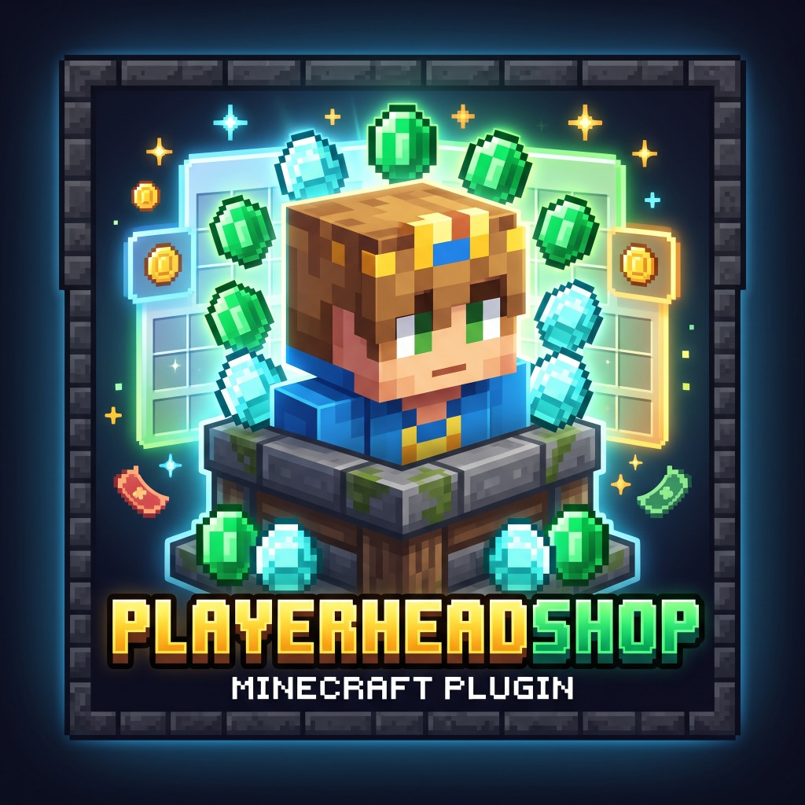

<p align="center">
  
</p>

<h1 align="center">PlayerHeadShop</h1>

<p align="center">
  <b>專為 Paper / Folia 1.21.4+ (Java 21) 設計的輕量級 Minecraft 自訂玩家頭顱購買插件</b><br>
  支援箱子 GUI 選單、個人皮膚即時預覽、多種兌換方案與 MiniMessage 訊息樣式
</p>

<p align="center">
  
  
  
  
</p>

---

## 🌟 功能特色

- **互動式箱子 GUI 介面**：輸入 `/buyhead` 即開啟直觀的箱子選單。
- **動態玩家皮膚預覽**：GUI 內的商品圖示自動渲染為點擊玩家自身的皮膚外觀 (`PLAYER_HEAD`)。
- **多種自訂方案 (Multi-Options)**：可在 `config.yml` 中自由配置任意數量與格子的兌換方案（自訂消耗物品、數量、獲得頭顱數、顯示名稱與說明）。
- **美化填充板 (Filler)**：支援以玻璃板填補空閒格子，保持介面美觀整潔。
- **完善防偷渡防護**：嚴格監聽點擊與拖曳事件，杜絕拿取、Shift 移動或快捷鍵置換。
- **背包滿溢保護**：當玩家背包空間不足時，溢出的頭顱將安全掉落於腳下 (`dropItemNaturally`)。
- **原生 Folia 執行緒相容**：完美支援 Folia 區域多執行緒（Regionized Multi-threading），操作安全穩定。
- **MiniMessage 訊息與樣式支援**：支援現代 Paper Adventure MiniMessage 顏色與樣式（包含漸層 `<gradient>`、彩色標籤與自訂佔位符）。
- **即時熱重載**：提供 `/buyhead reload` 即時重載設定檔與 GUI 內容。

---

## 📋 指令與別名

| 指令 | 別名 | 說明 | 預設權限 |
| :--- | :--- | :--- | :--- |
| `/buyhead` | `/playerheadshop`, `/headshop` | 開啟自訂頭顱商店 GUI 選單 | `playerheadshop.use` (所有人) |
| `/buyhead reload` | - | 重新加載 `config.yml` 設定檔與方案 | `playerheadshop.admin` (OP) |

---

## 🔐 權限節點

| 權限節點 | 說明 | 預設擁有者 |
| :--- | :--- | :--- |
| `playerheadshop.use` | 允許玩家使用 `/buyhead` 開啟商店介面 | `true` (所有玩家) |
| `playerheadshop.admin` | 允許管理員執行 `/buyhead reload` | `op` (伺服器管理員) |

---

## ⚙️ 設定檔 (`config.yml`)

```yaml
# =======================================================
#               PlayerHeadShop 插件設定檔
# =======================================================

# GUI 箱子介面設定
gui:
  title: "<gradient:#FFAA00:#FF5555><bold>自訂頭顱商店</bold></gradient>"
  rows: 3
  filler:
    enabled: true
    material: "GRAY_STAINED_GLASS_PANE"
    display-name: " "

# 多種兌換方案清單
# slot: 箱子格子編號 (0 ~ 53，例如 3 行介面為 0 ~ 26)
# display-name: 商品顯示名稱 (支援 MiniMessage 格式與佔位符)
# lore: 商品說明文字 (支援 MiniMessage 格式與佔位符)
# cost-item: 消耗物品 (有效 Bukkit Material 名稱，如 DIAMOND, EMERALD, GOLD_INGOT, NETHERITE_INGOT 等)
# cost-amount: 消耗數量
# head-amount: 獲得頭顱數量
options:
  - slot: 11
    display-name: "<yellow><bold>1 個頭顱</bold></yellow>"
    lore:
      - "<gray>購買印有自身皮膚外觀的頭顱。"
      - ""
      - "<white>獲得數量: <gold>1 個</gold></white>"
      - "<white>消耗物品: <aqua><cost_amount> 個 <cost_item></aqua></white>"
      - ""
      - "<green>▶ 點擊立即購買！</green>"
    cost-item: "DIAMOND"
    cost-amount: 1
    head-amount: 1

  - slot: 13
    display-name: "<gold><bold>8 個頭顱 (特惠包)</bold></gold>"
    lore:
      - "<gray>一次性購買 8 個個人頭顱。"
      - ""
      - "<white>獲得數量: <gold>8 個</gold></white>"
      - "<white>消耗物品: <aqua><cost_amount> 個 <cost_item></aqua></white>"
      - ""
      - "<green>▶ 點擊立即購買！</green>"
    cost-item: "DIAMOND"
    cost-amount: 7
    head-amount: 8

  - slot: 15
    display-name: "<light_purple><bold>64 個頭顱 (超值箱)</bold></light_purple>"
    lore:
      - "<gray>一整組 64 個個人頭顱，建造必備！"
      - ""
      - "<white>獲得數量: <gold>64 個</gold></white>"
      - "<white>消耗物品: <aqua><cost_amount> 個 <cost_item></aqua></white>"
      - ""
      - "<green>▶ 點擊立即購買！</green>"
    cost-item: "DIAMOND"
    cost-amount: 50
    head-amount: 64

# 自訂訊息（支援 MiniMessage 格式）
# 支援佔位符: <amount>, <item>, <cost_amount>, <cost_item>, <head_amount>, <required>, <current>, <missing>, <player>
messages:
  prefix: "<gray>[<gold>HeadShop</gold>]</gray> "
  success: "<green>你花費了 <gold><cost_amount> 個 <cost_item></gold> 購買了 <gold><head_amount> 個</gold> 自己的頭顱！</green>"
  not-enough-items: "<red>物品不足！需要 <gold><required> 個 <item></gold>，你目前只有 <gold><current> 個</gold>（缺少 <missing> 個）。</red>"
  inventory-full: "<yellow>你的背包已滿，溢出的頭顱已掉落在你的腳下！</yellow>"
  reload-success: "<green>PlayerHeadShop 設定檔已成功重新加載！</green>"
  no-permission: "<red>你沒有權限使用此指令！</red>"
  player-only: "<red>此指令僅限遊戲內玩家使用。</red>"
```

---

## 🛠️ 建構方式 (Build)

### 使用 Maven
```bash
mvn clean package
```
產出的 JAR 檔案將位於 `target/PlayerHeadShop-1.0.0.jar`。

### 使用 Gradle
```bash
./gradlew build
```
產出的 JAR 檔案將位於 `build/libs/PlayerHeadShop-1.0.0.jar`。
